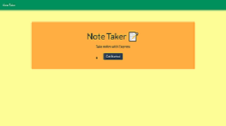

# Express-Note-Taker
________________________________________________________________________________________________________________________________________
________________________________________________________________________________________________________________________________________

**Description**
________________________________________________________________________________________________________________________________________

A node application that that saves and removes user notes using express app.get, .post, and .delete

The users notes get saved into an db.json file located in the db folder.

the database uses JSON formatting

- using the .get method, the express server gets and retrieves the notes stored in the db folder.
- the .post method allows express to add any new notes to the db.json file.
- .delete method, deletes the specific note from the db.json file.

________________________________________________________________________________________________________________________________________
________________________________________________________________________________________________________________________________________

**Instructions**
________________________________________________________________________________________________________________________________________

- clone repo
- run npm install
- run node server.js
- open your browser and navigate to http://localhost:3000/
________________________________________________________________________________________________________________________________________
 
 **This app is also deployed on Heroku**
  **You can view and test it online here**
   https://my-note-pad.herokuapp.com/
   - You might notice some notes already saved from prevoius users testing the app. feel free to add or delete notes as you like.
________________________________________________________________________________________________________________________________________
________________________________________________________________________________________________________________________________________

**image of application**
________________________________________________________________________________________________________________________________________

                   
________________________________________________________________________________________________________________________________________
________________________________________________________________________________________________________________________________________

**demo running server**
________________________________________________________________________________________________________________________________________

